# Auto-News System Analysis

> Generated: 2026-01-28
> Version: Post-Taranis migration

## Table of Contents

1. [System Architecture](#1-system-architecture)
2. [Notion Integration](#2-notion-integration)
3. [Deployment Configuration](#3-deployment-configuration)
4. [Collectors](#4-collectors)
5. [LLM Integration](#5-llm-integration)
6. [Agent Trigger Conditions](#6-agent-trigger-conditions)
7. [Database Schemas](#7-database-schemas)
8. [Data Flow](#8-data-flow)

---

## 1. System Architecture

### 1.1 High-Level Architecture

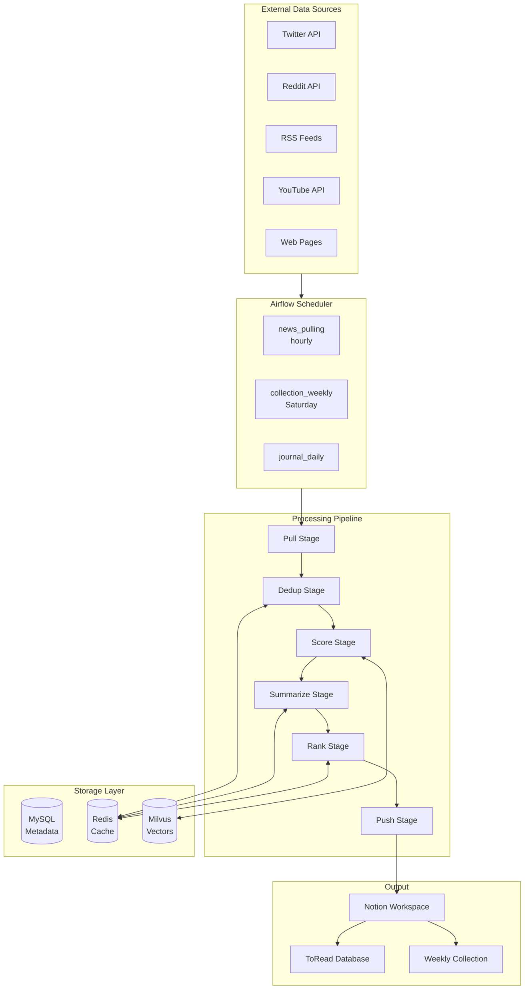

### 1.2 Component Overview

| Component | Technology | Purpose |
|-----------|------------|---------|
| Scheduler | Apache Airflow | DAG orchestration and scheduling |
| Message Broker | Redis | Celery task queue |
| Cache | Redis | Deduplication, LLM response caching |
| Vector DB | Milvus | Embedding storage and similarity search |
| Metadata DB | MySQL | Configuration and state tracking |
| LLM | OpenAI/Gemini/Ollama | Summarization and ranking |
| UI | Notion | User interface and data storage |

---

## 2. Notion Integration

### 2.1 Page Hierarchy

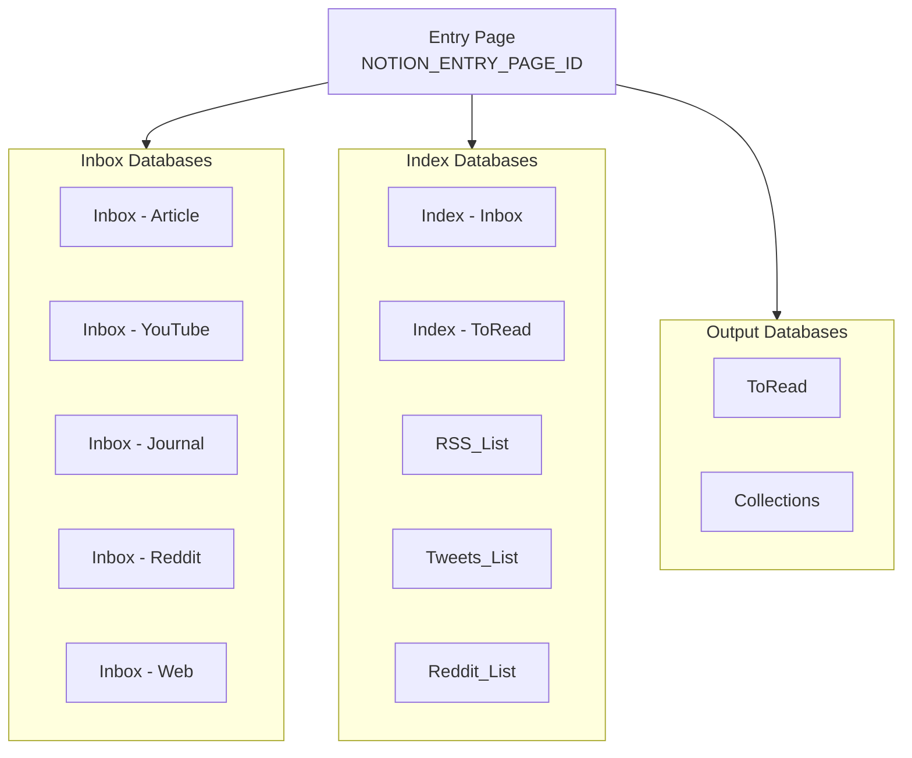

### 2.2 Database Schemas

#### RSS_List Database

| Column | Type | Required | Description |
|--------|------|----------|-------------|
| Name | Title | Yes | Feed name |
| URL | URL | Yes | RSS feed URL |
| Enabled | Checkbox | Yes | Enable/disable toggle |
| XPath | Text | No | Content extraction path (enhanced) |
| Browser Mode | Checkbox | No | Enable Playwright rendering (enhanced) |
| Fetch Full Article | Checkbox | No | Use Trafilatura extraction (enhanced) |
| Proxy | Text | No | Proxy server URL (enhanced) |

#### Web Source Database (New)

| Column | Type | Required | Description |
|--------|------|----------|-------------|
| Name | Title | Yes | Source name |
| URL | URL | Yes | Target web page URL |
| Enabled | Checkbox | Yes | Enable/disable toggle |
| XPath | Text | No | Content extraction XPath |
| Browser Mode | Checkbox | No | Enable Playwright rendering |
| Digest Splitting | Checkbox | No | Extract multiple articles from index |
| Digest Limit | Number | No | Max articles to extract (default: 30) |
| Proxy | Text | No | Proxy server URL |

#### ToRead Database

| Column | Type | Description |
|--------|------|-------------|
| Name | Title | Content title |
| Source | Select | Source type (RSS/Twitter/Reddit/YouTube/Web) |
| Rating | Number | LLM-generated score (0-1) |
| User Rating | Select | User rating (1-5 stars) |
| Relevant Score | Number | Vector similarity score |
| Topic | Multi-select | Extracted topics |
| Category | Multi-select | Extracted categories |
| Tags | Multi-select | User-defined tags |
| Take Aways | Rich Text | User notes and insights |
| Read | Checkbox | Read status |
| List | Multi-select | Source list name |
| Created at | Date | Publication date |

### 2.3 API Operations

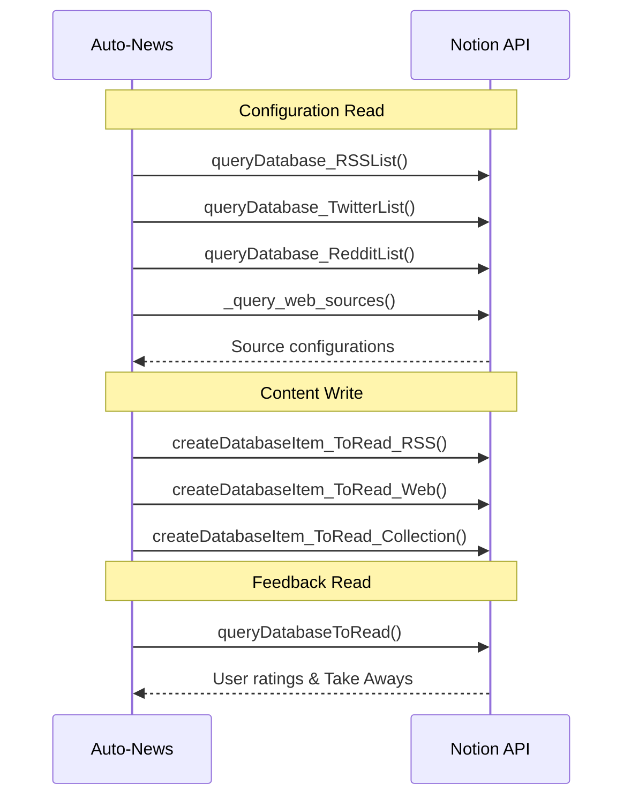

---

## 3. Deployment Configuration

### 3.1 Core Configuration

```env
# Notion (Required)
NOTION_TOKEN=ntn_xxxxxxxxxxxx
NOTION_ENTRY_PAGE_ID=xxxxxxxx-xxxx-xxxx-xxxx-xxxxxxxxxxxx

# Content Sources
CONTENT_SOURCES=Twitter,Reddit,Article,Youtube,RSS,Web
```

### 3.2 LLM Configuration

```env
# Provider: openai, google, ollama
LLM_PROVIDER=openai

# OpenAI
OPENAI_API_KEY=sk-xxxxxxxx
OPENAI_MODEL=gpt-4o-mini
OPENAI_API_BASE=https://api.openai.com/v1
OPENAI_PROXY=

# Google Gemini
GOOGLE_API_KEY=
GOOGLE_MODEL=gemini-1.5-flash-latest

# Ollama (Local)
OLLAMA_URL=http://localhost:11434
OLLAMA_MODEL=llama3
```

### 3.3 Embedding Configuration

```env
# Provider: openai, hf, hf_inst, ollama
EMBEDDING_PROVIDER=openai
EMBEDDING_MODEL=text-embedding-ada-002
EMBEDDING_MAX_LENGTH=5000

# Text Chunking
TEXT_CHUNK_SIZE=10240
TEXT_CHUNK_OVERLAP=256
```

### 3.4 Database Configuration

```env
# MySQL
MYSQL_HOST=mysql-db
MYSQL_PORT=3306
MYSQL_USER=bot
MYSQL_PASSWORD=bot
MYSQL_DATABASE=bot

# Redis
BOT_REDIS_URL=redis://:@redis:6379/1
BOT_REDIS_KEY_EXPIRE_TIME=604800    # 7 days

# Milvus
MILVUS_HOST=milvus-standalone
MILVUS_PORT=19530
MILVUS_SIMILARITY_METRICS=L2        # L2, IP, COSINE
```

### 3.5 Source-Specific Configuration

```env
# Twitter
TWITTER_API_KEY=
TWITTER_API_KEY_SECRET=
TWITTER_ACCESS_TOKEN=
TWITTER_ACCESS_TOKEN_SECRET=
TWITTER_FILTER_MIN_SCORES=AI:4.5,Life:4,Game:5

# Reddit
REDDIT_CLIENT_ID=
REDDIT_CLIENT_SECRET=
REDDIT_PULLING_COUNT=25
REDDIT_FILTER_MIN_SCORES=Game:4.5,AI:5
REDDIT_ENABLE_CLASSIFICATION=false

# YouTube
YOUTUBE_TRANSCRIPT_LANGS=en,zh

# RSS
RSS_ENABLE_CLASSIFICATION=false
```

### 3.6 Processing Configuration

```env
# Summary
SUMMARY_MAX_LENGTH=20000
TRANSLATION_LANG=              # Target language (optional)

# Scoring
MIN_SCORE_TO_RANK=4
MAX_DISTANCE=0.5               # Max vector similarity distance

# DeepDive (Experimental)
ACTION_DEEPDIVE_ENABLED=false
ACTION_DEEPDIVE_ITERATIONS=1
```

---

## 4. Collectors

### 4.1 Collector Types

| Collector | Class | Data Source | Dependencies |
|-----------|-------|-------------|--------------|
| Twitter | `OperatorTwitter` | Twitter API v2 | tweepy |
| Reddit | `OperatorReddit` | Reddit API | praw |
| RSS | `OperatorRSS` | RSS/Atom Feeds | feedparser |
| YouTube | `OperatorYoutube` | YouTube | youtube-transcript-api |
| Article | `OperatorArticle` | Notion Inbox | notion-client |
| Web | `OperatorWeb` | Web Pages | playwright, trafilatura |

### 4.2 Class Hierarchy

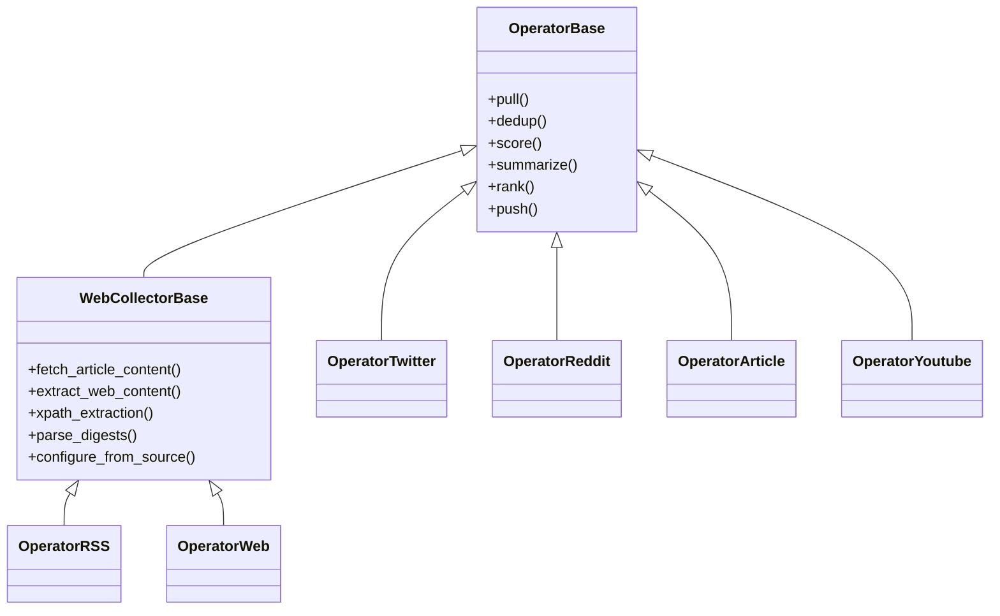

### 4.3 Collector Pipeline

```mermaid
flowchart LR
    subgraph Pull
        P1[Query Notion Config]
        P2[Fetch from Source]
        P3[Extract Metadata]
        P4[Generate Hash]
    end

    subgraph Dedup
        D1[Check Redis Cache]
        D2[Check Notion ToRead]
        D3[Store Processed IDs]
    end

    subgraph Score
        S1[Generate Embedding]
        S2[Milvus Similarity Search]
        S3[Calculate Relevance]
    end

    subgraph Summarize
        SM1[Load Content]
        SM2[LLM Generate Summary]
        SM3[Cache to Redis]
    end

    subgraph Rank
        R1[LLM Extract Topics]
        R2[LLM Calculate Score]
        R3[Filter by Min Score]
    end

    subgraph Push
        PU1[Create Notion Page]
        PU2[Set Properties]
        PU3[Add Content Blocks]
    end

    Pull --> Dedup --> Score --> Summarize --> Rank --> Push
```

### 4.4 Web Collector Features

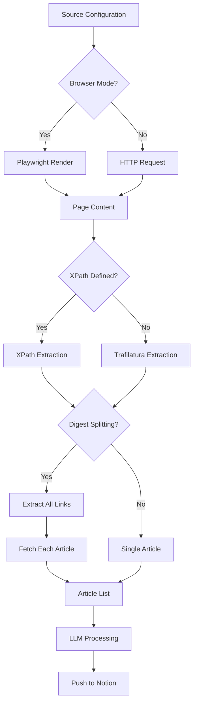

---

## 5. LLM Integration

### 5.1 Supported Providers

| Provider | Models | Configuration |
|----------|--------|---------------|
| OpenAI | gpt-4o-mini, gpt-4o, gpt-3.5-turbo | OPENAI_API_KEY |
| Google Gemini | gemini-1.5-flash-latest, gemini-pro | GOOGLE_API_KEY |
| Ollama | llama3, llama2, mistral, etc. | OLLAMA_URL |

### 5.2 LLM Agent Types

| Agent | Purpose | Output |
|-------|---------|--------|
| `LLMAgentSummary` | Generate article summaries | Structured summary text |
| `LLMAgentCategoryAndRanking` | Classify and score content | JSON with topics, categories, score |
| `LLMAgentRanking` | Re-rank content | Sorted list with scores |
| `LLMAgentGeneric` | Custom tasks | Variable |

### 5.3 LLM Invocation Points

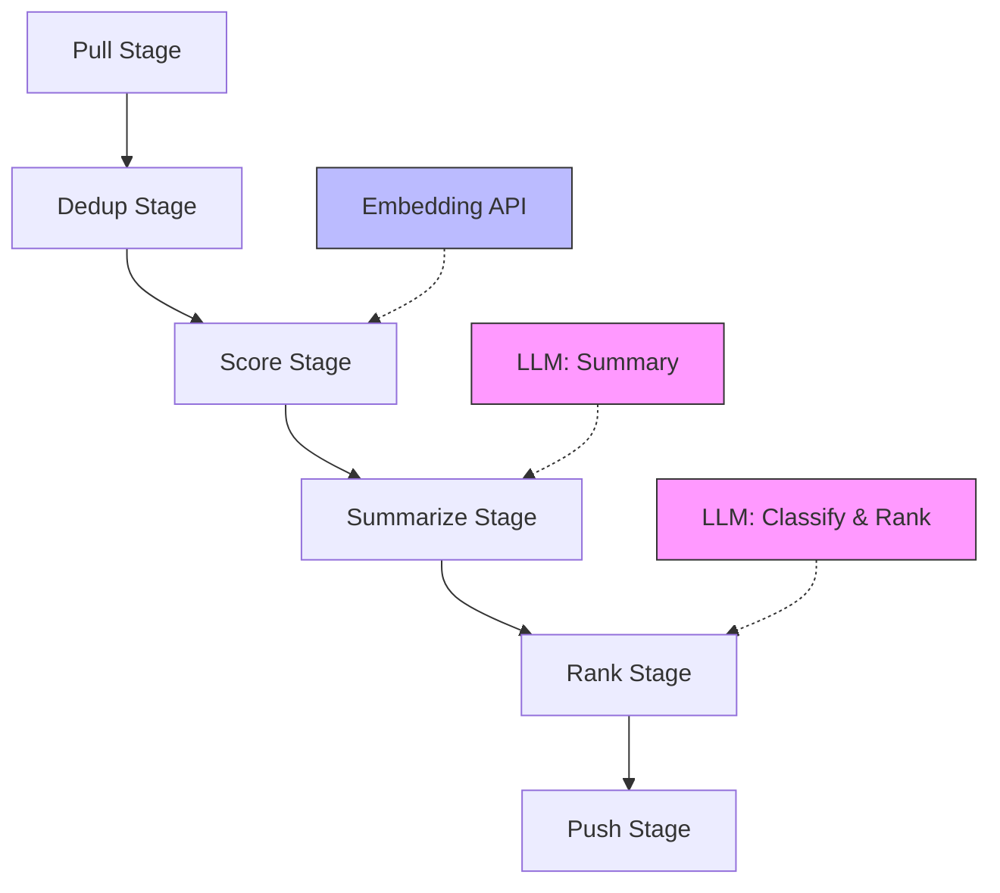

### 5.4 Embedding Providers

| Provider | Model | Dimensions |
|----------|-------|------------|
| OpenAI | text-embedding-ada-002 | 1536 |
| OpenAI | text-embedding-3-small | 1536 |
| HuggingFace | all-MiniLM-L6-v2 | 384 |
| HF Instructor | hkunlp/instructor-xl | 768 |
| Ollama | nomic-embed-text | 768 |

---

## 6. Agent Trigger Conditions

### 6.1 Airflow DAG Schedule

| DAG | Schedule | Trigger Condition |
|-----|----------|-------------------|
| `news_pulling` | `15 * * * *` (minute 15 hourly) | Always |
| `collection_weekly` | `30 2 */1 * *` (02:30 daily) | Saturday only (or force_to_run=true) |
| `journal_daily` | Daily | Always |
| `sync_dist` | Periodic | Configurable |
| `action` | On-demand | ACTION_DEEPDIVE_ENABLED=true |

### 6.2 news_pulling DAG Flow

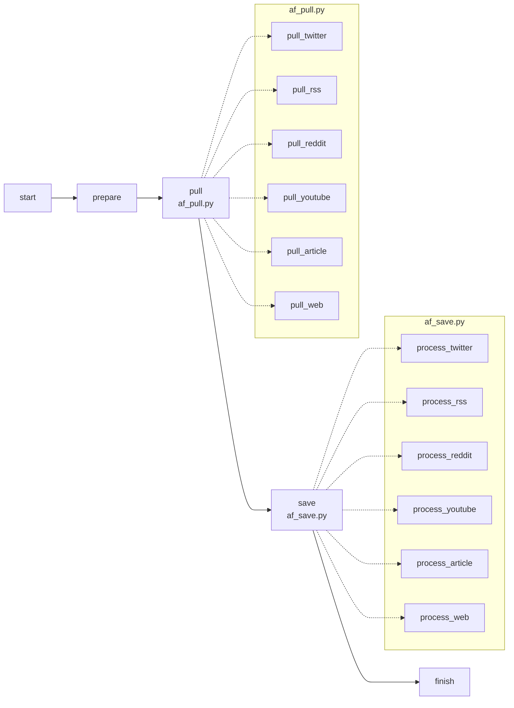

### 6.3 collection_weekly DAG Flow

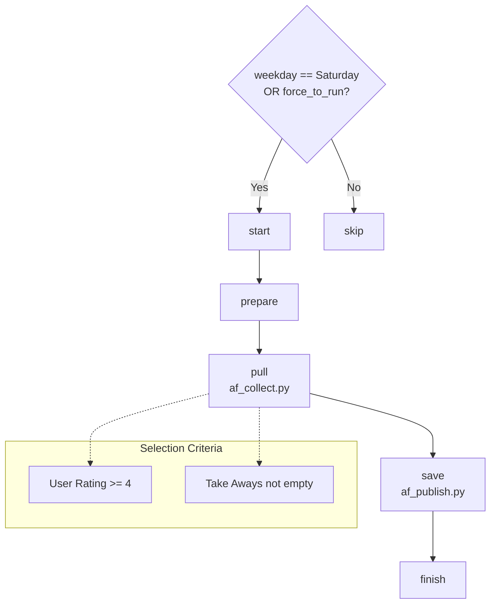

### 6.4 Trigger Conditions Summary

| Condition | Triggered Action |
|-----------|------------------|
| Every hour at :15 | Execute all collectors (pull → process → push) |
| Saturday 02:30 | Create weekly Collection |
| User Rating >= 4 | Include in weekly Collection |
| Take Aways not empty | Include in Collection (regardless of rating) |
| Relevant Score >= min_score | Pass LLM ranking stage |
| ACTION_DEEPDIVE_ENABLED=true | Trigger DeepDive research |

---

## 7. Database Schemas

### 7.1 MySQL Tables

#### index_pages

```sql
CREATE TABLE index_pages (
    id BIGINT PRIMARY KEY AUTO_INCREMENT,
    category VARCHAR(256) NOT NULL,      -- "notion", "obsidian"
    name VARCHAR(256) NOT NULL,          -- config key name
    index_id VARCHAR(256) NOT NULL,      -- Notion page/database ID
    created_at DATETIME DEFAULT NOW(),
    updated_at DATETIME DEFAULT NOW(),
    UNIQUE KEY (category, name)
);
```

Stored configurations:
- `entry_page_id`
- `index_page_id`
- `index_inbox_db_id`
- `index_toread_db_id`
- `index_rss_list_db_id`
- `index_tweets_list_db_id`
- `index_reddit_list_db_id`

#### patch

```sql
CREATE TABLE patch (
    id INT PRIMARY KEY AUTO_INCREMENT,
    name VARCHAR(256) UNIQUE NOT NULL,
    order_id INT UNIQUE NOT NULL,
    created_at DATETIME DEFAULT NOW()
);
```

### 7.2 Redis Cache Keys

| Key Pattern | TTL | Purpose |
|-------------|-----|---------|
| `notion_toread_item_id_{source}_{list}_{id}` | 7 days | Deduplication tracking |
| `notion_inbox_item_id_{source}_{list}_{id}` | 7 days | Inbox item tracking |
| `notion_summary_item_id_{source}_{list}_{id}` | 7 days | LLM summary cache |
| `notion_ranking_item_id_{source}_{list}_{id}` | 7 days | LLM ranking cache |
| `milvus_embedding_item_id_{provider}_{model}_{source}_{id}` | 28 days | Embedding tracking |
| `notion_toread_last_edited_{source}_{list}` | - | Timestamp tracking |

### 7.3 Milvus Collections

```
Collection: embeddings_{provider}_{model}_{source}
├── Vector Dimension: 384/768/1536 (model-dependent)
├── Metadata: source_id, created_time, url, title
├── Index Type: IVF_FLAT
└── Distance Metric: L2 / IP / COSINE
```

---

## 8. Data Flow

### 8.1 Complete Data Flow

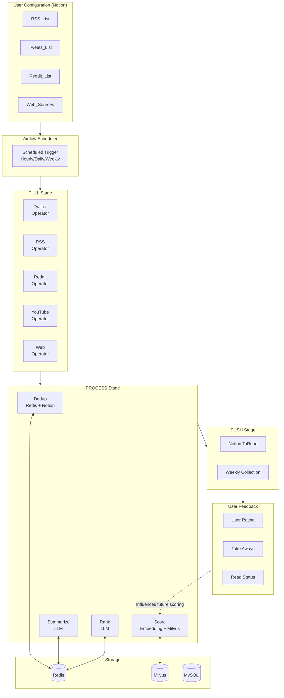

### 8.2 Weekly Collection Flow

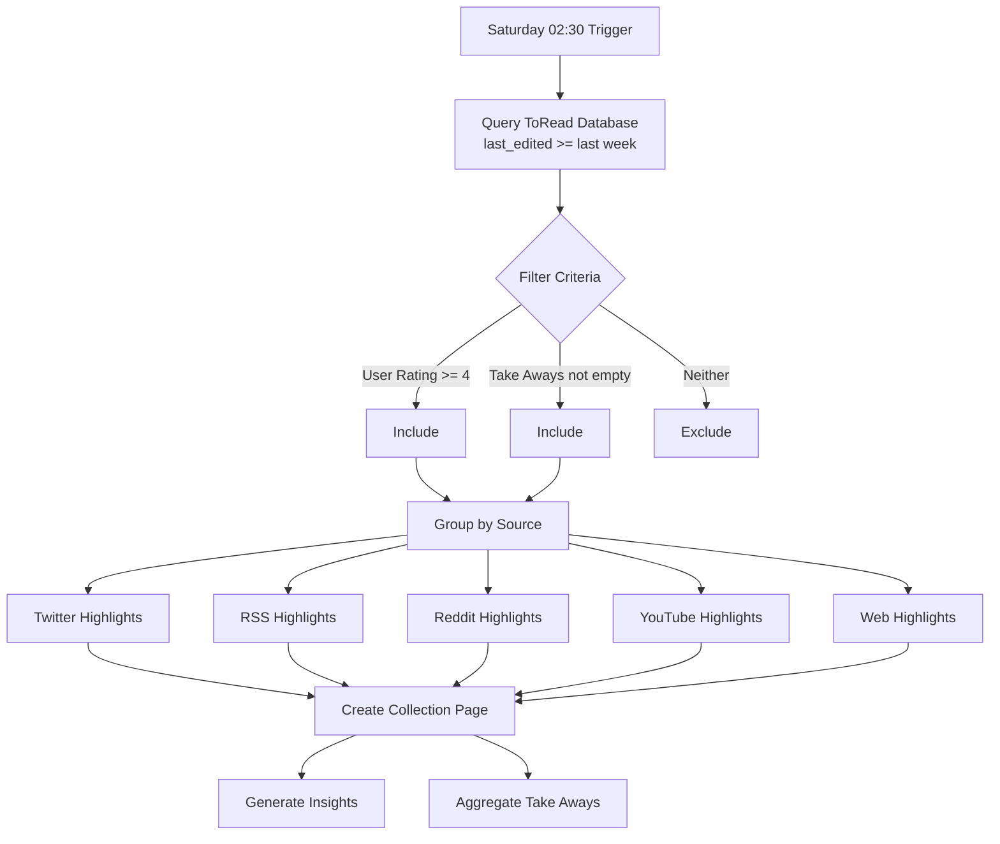

---

## Appendix: Key Files Reference

| Component | File | Description |
|-----------|------|-------------|
| Notion Integration | `src/notion.py` | Notion API client (2000+ lines) |
| Notion Operations | `src/ops_notion.py` | High-level Notion operations |
| LLM Agent | `src/llm_agent.py` | LLM call wrapper |
| LLM Prompts | `src/llm_prompts.py` | Prompt templates |
| Base Operator | `src/ops_base.py` | Operator base class |
| Web Base | `src/ops_web_base.py` | Web collector base (new) |
| RSS Collector | `src/ops_rss.py` | RSS collector (enhanced) |
| Web Collector | `src/ops_web.py` | Web collector (new) |
| Playwright | `src/playwright_manager.py` | Browser automation (new) |
| Pull Pipeline | `src/af_pull.py` | Data pulling |
| Save Pipeline | `src/af_save.py` | Processing and pushing |
| DAG Definition | `dags/news_pulling.py` | Airflow DAG |
| Data Model | `src/data_model.py` | Redis key definitions |
| DB Tables | `src/db_tables.py` | MySQL table definitions |
| Docker | `docker/docker-compose.yaml` | Container orchestration |
| Config Template | `.env.template` | Environment variables |

---

*Document generated by Claude (pa/claude-opus-4-5-20251101)*
